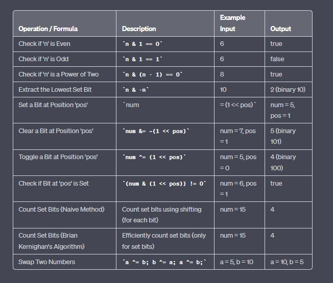

<h2> Tips and Tricks </h2>

* Integer contains 32 bits, 1 bit is used for a sign flag (0 is + and 1 is -) and remaining 31 bits for values.
For negative values we can express 2^31 different values (from -1 to -2^31) and for positive values 
it is one value less since we still need to express zero.
So, for positive we can express 2^31-1values with 31 bits, from 1 to 2^31-1. 
That's why max negative and max positive do not match.
<h3> Formulas </h3>

```
a+b = (a^b) + (a&b)
```



<h2> Best Tutorials and Blogs</h2>

Need to Update
