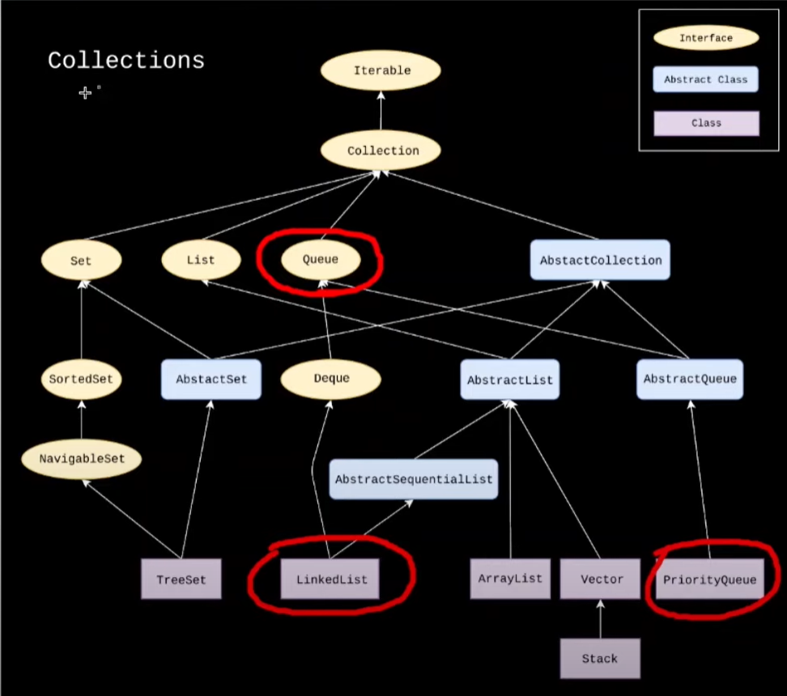

<h3> Concurrent Types </h3>

<b><u> Vector, Hashtable and EnumSet </u></b> are conncurent i.e these data structures can be used while implementing Threading or concurrent Operations.

<h3> Tips & Tricks </h3>

* Always Declare ArrayList with Default Size (Since List does not know the Size we require, It will Try to Shift the Existing data to New array when its reached 70% Capacity). Moving to a New array, Deleting existing is Resource Intensive , hence having a default size Helps to Create New array efficiently when Size is being increased.

* When Using Custom Objects in Collections Instead of Default (Integer, String, etc.), Override the Specific Methods of those collections to Perfectly Perform the Expected.
Ex :  For Hashset , Override Hashcode and Equals Method. Check Path Crossing Problem Solution for Better Understanding. (https://leetcode.com/problems/path-crossing/description/)

Reason : JVM Understands 2 Objects as always different, Unless there is a specific implemnetation specified for comparision. Integer, String, etc.. have default Implementations, hence we would not face any issue with them

