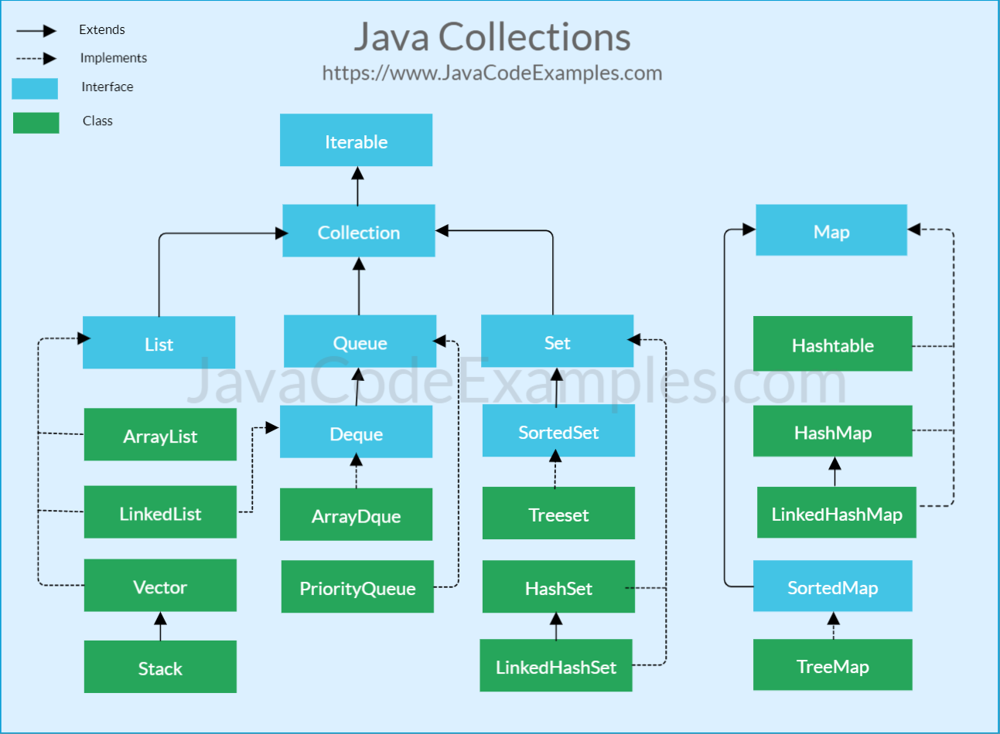

<h3> Concurrent Types </h3>

<b><u> Vector, Hashtable and EnumSet </u></b> are conncurent i.e these data structures can be used while implementing Threading or concurrent Operations.

<h3> Tips & Tricks </h3>

* Always Declare ArrayList with Default Size (Since List does not know the Size we require, It will Try to Shift the Existing data to New array when its reached 70% Capacity). Moving to a New array, Deleting existing is Resource Intensive , hence having a default size Helps to Create New array efficiently when Size is being increased.