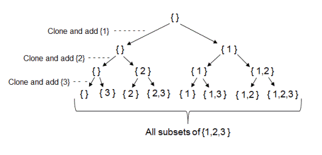

|             Approach             | Time Complexity | Space Complexity |                                       Comments                                       |
| :------------------------------: | :-------------: | :--------------: | :----------------------------------------------------------------------------------: |
|            Iterative             |     O(2^N)      |       O(N)       |                                                                                      |
|     Recursive (Binary Split)     |     O(2^N)      |       O(N)       |                                                                                      |
| Recursive BackTracking (N Split) |     O(2^N)      |       O(N)       | It is Optimal as we are getting result faster in most of cases unlike pure recursive |

- In the Recursion Binary Split Approach, we can observe at the End Level we get our result sets. Hence We check ind == n and add.
  Each recursion level focuses on one element, we need to decide choose or not choose this element. (Every level split into 2 branches.)
  <b> This is Completely Recursive </b> as result is achieved while going forward
  

- In the RecursionNSpliit Approach , Each recursion level focuses on all the following elements. We scan through all the following elements and decide whether to choose or not choose that element. (Every level split into N branches.)
  <b> This is Recursive BackTracking </b> as result is achieved while coming back.
